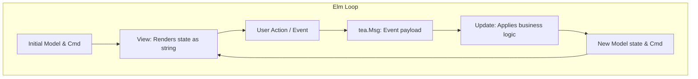

# Learning Go with `hn-client`

Welcome! This tutorial is designed to teach you the fundamentals of the **Go programming language** by using the TUI client we just built together (`hn-client`) as our live learning sandbox. 

Instead of dry, abstract syntax examples, we will dissect real code from [main.go](./main.go) and explain how Go constructs it under the hood.

---

## 1. Project Structure & Modules

Go projects are organized around **modules** and **packages**.

### The Module (`go.mod`)
In the root directory, you'll find [go.mod](./go.mod). This file declares the module's path and lists its third-party dependencies:
```go
module github.com/aeon022/hn-client

go 1.21

require (
    github.com/charmbracelet/bubbles v0.16.1
    github.com/charmbracelet/bubbletea v0.24.2
    github.com/charmbracelet/lipgloss v0.8.0
    // ... other packages
)
```
*   `module` defines the import namespace for files within your project.
*   `require` lists the specific versions of libraries (like Bubble Tea and Lip Gloss) used.

### The Entry Point (`main.go`)
Every executable Go program starts in a package named `main` and runs a function named `main()`:
```go
package main

import (
	"fmt"
	"os"
	// ...
)

func main() {
	// Program starts here!
}
```

---

## 2. Variables, Structs & Custom Types

Go is a **statically typed** language, meaning variable types are checked at compile time.

### Declaring Structs (Custom Objects)
In Go, we don't have classical object-oriented classes. Instead, we use `struct` to group variables together. Look at the `comment` struct in `main.go`:
```go
type comment struct {
	item     hnapi.Item // Custom type from our API package
	children []comment  // A slice (resizable array) of child comments
	indent   int        // An integer tracking nesting depth
}
```
And our main program state, `model`:
```go
type model struct {
	stories  []hnapi.Item      // Slice of Hacker News stories
	comments map[int][]comment // A hash map (Key: story ID -> Value: list of comments)
	cursor   int               // The selected index in lists
	state    state             // Enum representing list view or detail view
	ready    bool              // Has the viewport finished initializing?
}
```

### Initializing Structs (Constructor pattern)
Go doesn't have class constructors. Instead, we write helper functions that return initialized instances of our structs, like `initialModel()`:
```go
func initialModel() model {
	ti := textinput.New() // Initialize a text input field library helper
	ti.Placeholder = "Search..."
	
	return model{
		loading:      true,
		comments:     make(map[int][]comment), // Allocating memory for our hash map
		cursor:       0,
		state:        stateList,
		searchInput:  ti,
	}
}
```
> [!NOTE]
> `make(map[Type]Type)` is Go's built-in function used to initialize reference types like maps and slices. If you don't allocate it using `make()`, writing to the map will trigger a runtime panic (crash).

---

## 3. Control Flow & Methods

Go features loops, conditionals, switch blocks, and receiver functions.

### Switch Case (No implicit fallthrough)
Go `switch` blocks are clean because they break automatically. You don't need to write `break;` at the end of every case:
```go
switch msg.String() {
case "q", "ctrl+c":
    return m, tea.Quit
case "up", "k":
    if m.cursor > 0 {
        m.cursor--
    }
case "down", "j":
    // ...
}
```

### Receiver Methods (Attaching functions to structs)
In Go, you can attach functions to custom types using a **receiver**. This behaves similarly to instance methods in other languages:
```go
// (m model) is the receiver. Inside the function, 'm' refers to the active model state.
func (m model) View() string {
	if m.loading {
		return "Loading..."
	}
	return m.viewport.View()
}
```
*   `m model` is a **value receiver** (it receives a copy of the model).
*   `m *model` is a **pointer receiver** (it receives a pointer to the original memory address, allowing the function to modify the actual struct fields directly). For example:
```go
func (m *model) updateViewport() {
	// Modifies fields of the original model struct
	m.viewport.SetContent("New Content")
}
```

---

## 4. The Elm TUI Architecture (Bubble Tea)

`hn-client` runs on a loop inspired by the **Elm Architecture** (Model-Update-View).



1.  **Model**: The data representing the current state of the application.
2.  **Update**: A function called whenever an event (keystroke, mouse wheel, network response) occurs. It returns a modified Model and optional **Commands** (`tea.Cmd`).
3.  **View**: A function called after every update that takes the current Model state and returns a single formatted string containing what the terminal should render.

---

## 5. Concurrency & Asynchronous Operations

Go is famous for its simple concurrency primitives: **Goroutines** and **Channels**. In Bubble Tea, asynchronous operations are triggered via **Commands** (`tea.Cmd`).

### How We Fetch HN Stories Asynchronously
When switching categories, we don't want the UI to freeze while waiting for the Hacker News API. We use a command function to fetch data in the background:
```go
func fetchStories(category string) tea.Cmd {
	// Returns a function that will be executed inside a background goroutine
	return func() tea.Msg {
		ids, err := hnapi.GetStories(category)
		if err != nil {
			return errMsg{err} // Send error event to the Update loop
		}
		// Fetch actual details...
		return statusMsg(stories) // Send successful statusMsg event
	}
}
```
When the background request completes, Bubble Tea automatically pipes the return value (`statusMsg` or `errMsg`) back into our program's `Update()` function as a message:
```go
func (m model) Update(msg tea.Msg) (tea.Model, tea.Cmd) {
	switch msg := msg.(type) {
	case statusMsg:
		m.stories = msg // Populate list with stories
		m.loading = false
		m.updateViewport()
		return m, nil
	}
}
```

---

## 6. Running OS Processes (`w3m` Integration)

One of the coolest features of `hn-client` is opening links and forms directly inside terminal browsers like `w3m` and `lynx` without closing the TUI.

Go's standard `os/exec` package handles launching command line tools, and Bubble Tea handles suspending the TUI during execution via `tea.ExecProcess`:
```go
func openURL(url string) tea.Cmd {
	c := exec.Command("w3m", url)
	
	// tea.ExecProcess suspends our TUI alt screen, hands control to w3m,
	// and restores our TUI alt screen state when w3m is closed!
	return tea.ExecProcess(c, func(err error) tea.Msg {
		if err != nil {
			return errMsg{err}
		}
		return nil
	})
}
```

---

## 7. Your Learning Sandbox Exercises

Ready to get your hands dirty? Try these simple modifications in `main.go` to test your understanding of Go:

### Exercise 1: Customizing Keybindings
**Goal:** Make the letter `h` act as a secondary key to go back from the comments view to the story list (in addition to `esc` or `q`).
*   **Where to edit:** Inside the keyboard message handler of the `Update` function (`case tea.KeyMsg:`).
*   **Hint:** Find `case "esc", "backspace":` or `case "q", "ctrl+c":` and check how it switches back to `stateList`.

### Exercise 2: Adjusting Text Layout
**Goal:** Add a prefix emoji (like `📰 `) to the section header divider in the comments view.
*   **Where to edit:** Find the `updateViewport()` function, specifically where `── Comments ──` is defined.

---

## Cheat Sheet: Go vs. Others

| Concept | Python | Javascript | Go |
| :--- | :--- | :--- | :--- |
| **Typing** | Dynamic | Dynamic | Static & Typed |
| **Object Model** | Classes & Inheritance | Prototype inheritance | Structs & Interfaces |
| **Concurrency** | Asyncio / Threads | Event Loop / Promises | Goroutines & Channels |
| **Compilation** | Interpreted | JIT (Browser/Node) | Compiled to machine code |
| **Error Handling**| Exceptions (`try/catch`) | Exceptions (`try/catch`) | Explicit error return |
